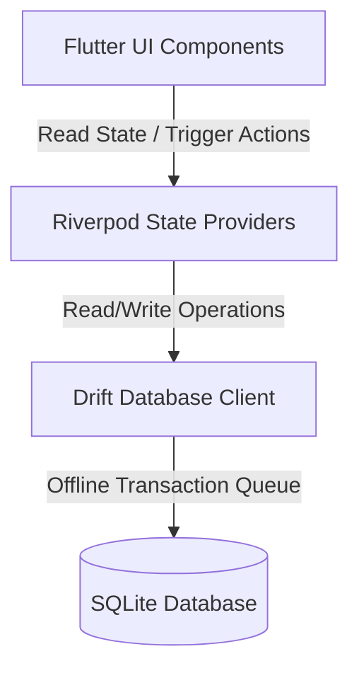

<div align="center">
  
  
  # ⚡ VeeBrew POS
  
  **A High-Voltage, Zero-Latency, Offline-First Point of Sale System**
  
  *Designed with precision for high-throughput coffee shops, breweries, and retail environments.*
  
  [](https://flutter.dev)
  [](https://riverpod.dev)
  [](https://drift.simonbinder.eu/)
  [](#)

</div>

---

## ⚡ The Concept & Brand Personality

VeeBrew POS rejects standard pastel, low-contrast, laggy tablet designs. Inspired by modern trading interfaces, it is styled with a **high-voltage, Binance-inspired dark trading theme**:
* **Canvas Dark Backgrounds** to mitigate operator eye strain during long shifts.
* **Vibrant Binance Yellow (`#FCD535`) Accents** reserved exclusively for active states, selected items, and critical calls-to-action to guide the operator's eye instantly.
* **Tabular Numerical Precision** using monospace alignment for all prices, counts, and transaction sums to ensure rapid scanning.
* **Flat Depth Separation** without soft drop shadows or resource-heavy glassmorphism, maximizing rendering performance on low-spec terminal hardware.

---

## 🚀 Core Capabilities

<table width="100%">
  <tr>
    <td width="33.3%" valign="top">
      <h3>⚡ POS Terminal</h3>
      <ul>
        <li><b>High-Throughput Order Grid</b>: Categorized grids with instantaneous product and modifier selection (milk, shot additions, sweetness levels).</li>
        <li><b>Dynamic Ticket Summary</b>: Live, auto-calculating ticket layout with clear modifiers display.</li>
        <li><b>Quick Checkout</b>: Direct cash, GCash, or custom payment views for split-second checkouts.</li>
      </ul>
    </td>
    <td width="33.3%" valign="top">
      <h3>📊 Admin Control Center</h3>
      <ul>
        <li><b>Sales Dashboard</b>: Real-time transaction metrics, revenue tracking, and order history list.</li>
        <li><b>Inventory & Modifier Management</b>: Centralized panels to control product statuses, prices, and reusable modifiers.</li>
        <li><b>Receipt Customization</b>: Instant adjustments for company headers, footers, and spacing.</li>
      </ul>
    </td>
    <td width="33.3%" valign="top">
      <h3>🔄 Offline-First Sync</h3>
      <ul>
        <li><b>Drift local schema</b>: Local SQLite engine manages orders, products, and modifiers.</li>
        <li><b>Zero-network reliance</b>: Complete checkouts locally; transaction records sync immediately once connection is detected.</li>
      </ul>
    </td>
  </tr>
</table>

---

## 📱 Visual Showcase

We use clean layout structures matching the high-voltage aesthetic. Below are screenshot guides for active deployment modules:

<table>
  <tr>
    <td width="50%" align="center">
      <b>⚡ POS Checkout Interface</b>
      <br/><br/>
      
      <br/>
      <i>Placeholder: Capture the main checkout page showing the product grid and yellow total button.</i>
    </td>
    <td width="50%" align="center">
      <b>📊 Admin Control Panel</b>
      <br/><br/>
      
      <br/>
      <i>Placeholder: Capture the sales history tab or product modifier management view.</i>
    </td>
  </tr>
</table>

---

## 🛠️ Tech Stack & Architecture

VeeBrew POS is architected for clean boundaries, predictable state mutation, and reliable offline operations:



* **Frontend**: [Flutter](https://flutter.dev) (Dart) - Compiled natively to Windows and Android to eliminate sluggish web views.
* **State Management**: [Riverpod](https://riverpod.dev) - Unidirectional data flow keeping UI state isolated from persistence.
* **Local Persistence**: [Drift](https://drift.simonbinder.eu/) + [SQLite](https://sqlite.org) - Typed-safe reactive queries with built-in schema migration capabilities.

---

## 📂 Project Organization

```text
lib/
├── database/         # SQLite schema, tables definitions, and Drift database clients
├── main.dart         # App initialization, Riverpod scopes, and app launch config
├── models/           # Common domain models and business definitions
├── providers/        # Riverpod providers handling POS, Cart, Admin, and Sync state
├── screens/          # Top-level screen views (POS screen, Admin screen)
└── widgets/          # Highly modular widgets (Product grid, Admin panels, Receipt layout)
```

---

## ⚡ Getting Started

### Prerequisites
- Flutter SDK (v3.22.0 or higher recommended)
- Android SDK / Windows C++ Build Tools (depending on target platform)

### Setup & Installation

1. **Clone the Repository:**
   ```bash
   git clone https://github.com/Herodot0s/Vee-Brew-POS.git
   cd Vee-Brew-POS
   ```

2. **Fetch Dependencies:**
   ```bash
   flutter pub get
   ```

3. **Generate Drift Database Code:**
   VeeBrew POS uses Drift code generation for persistence mappings. Generate them by running:
   ```bash
   dart run build_runner build --delete-conflicting-outputs
   ```

4. **Launch the Application:**
   - Run on Windows Desktop:
     ```bash
     flutter run -d windows
     ```
   - Run on Android Device/Emulator:
     ```bash
     flutter run -d android
     ```

---

## 📄 License

This project is configured for proprietary development and operations at **VeeBrew**. All rights reserved.
